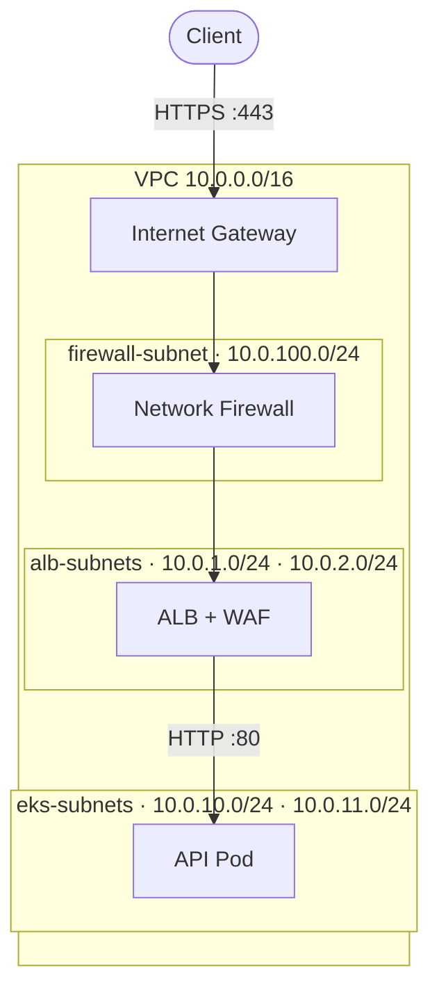
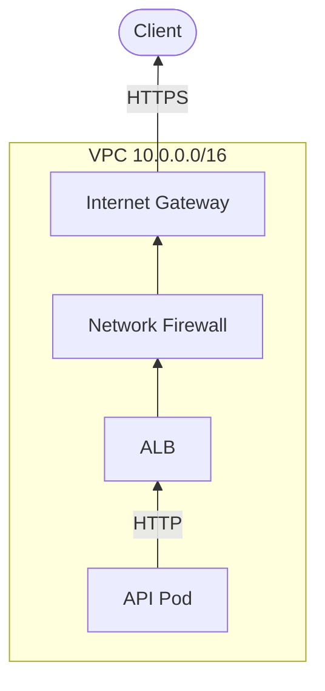
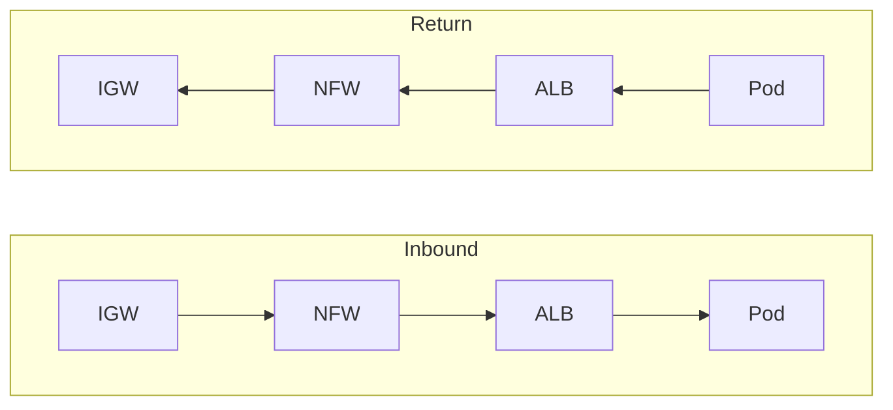
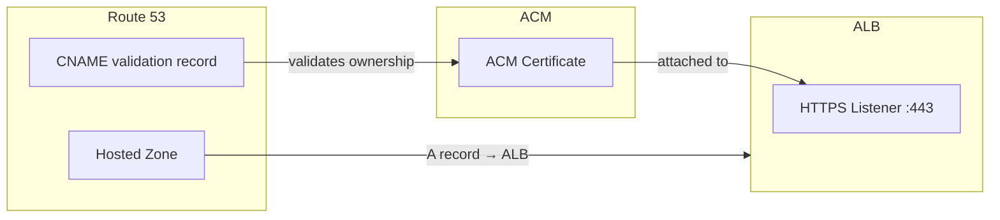
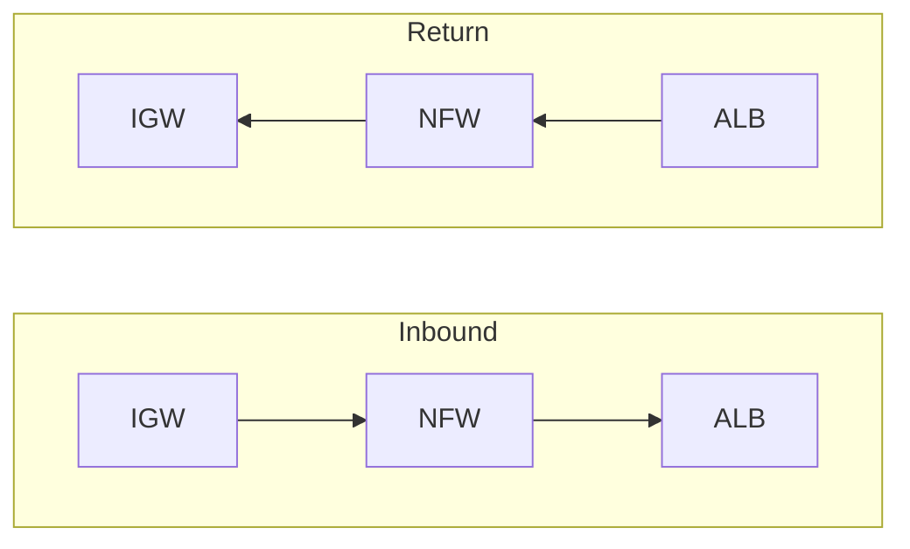
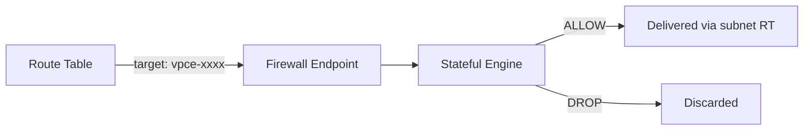
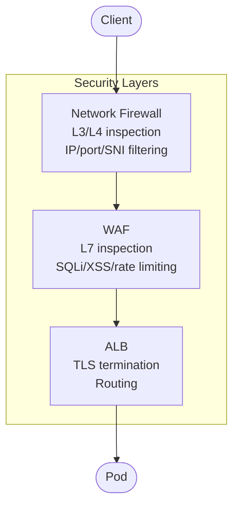

# EKS Ingress with Network Firewall — Architecture Documentation

## Overview

This document describes the complete architecture for exposing an API running in EKS to the internet, with inline network inspection via AWS Network Firewall. All inbound and outbound internet traffic passes through the firewall transparently — no NAT, no IP changes.

HTTPS is terminated at the ALB using an ACM certificate validated via Route 53. AWS WAF provides Layer 7 protection on the ALB.

---

## Architecture Diagram



## Return Path



## Symmetric Routing



---

## DNS and Certificate



### How it works

1. **Register domain** in Route 53 → creates a hosted zone
2. **Request ACM certificate** for the domain (e.g. `api.example.com`)
3. **DNS validation** — ACM provides a CNAME record, add it to the hosted zone. ACM verifies ownership and issues the certificate
4. **Attach certificate** to the ALB listener via Ingress annotation (`certificate-arn`)
5. **Create A record** (alias) in Route 53 pointing the domain → ALB DNS name
6. **Auto-renewal** — ACM renews the certificate automatically before expiry

---

## TLS / HTTPS

| Component | Protocol | Notes |
|-----------|----------|-------|
| Client → ALB | HTTPS (TLS 1.2/1.3) | Encrypted. ACM certificate on ALB listener :443 |
| Network Firewall | Sees encrypted packets | Inspects L3/L4 headers and TLS SNI only |
| WAF (on ALB) | Sees decrypted HTTP | Inspects after TLS termination |
| ALB → Pod | HTTP | Unencrypted inside VPC |

> **Processing order at the ALB:** TLS termination → WAF evaluation → routing to target pod.

---

## Subnets

| Subnet | CIDR | Type | AZ | Purpose |
|--------|------|------|----|---------|
| alb-subnet-1 | 10.0.1.0/24 | Public | us-east-1a | ALB (internet-facing) |
| alb-subnet-2 | 10.0.2.0/24 | Public | us-east-1b | ALB (internet-facing) |
| firewall-subnet | 10.0.100.0/24 | Public | us-east-1a | Network Firewall endpoint |
| eks-subnet-1 | 10.0.10.0/24 | Private | us-east-1a | EKS worker nodes |
| eks-subnet-2 | 10.0.11.0/24 | Private | us-east-1b | EKS worker nodes |
| nat-subnet | 10.0.200.0/24 | Public | us-east-1a | NAT Gateway (EKS outbound) |

---

## Route Tables

### 1. igw-edge-rt (attached to the Internet Gateway)

By attaching a route table to the IGW, we intercept packets **after** the IGW performs its public→private IP translation but **before** they reach the destination subnet.

| Destination | Target | Purpose |
|-------------|--------|---------|
| 10.0.1.0/24 | Firewall endpoint | Force ALB-subnet-1 traffic through firewall |
| 10.0.2.0/24 | Firewall endpoint | Force ALB-subnet-2 traffic through firewall |

> No `0.0.0.0/0` route here. Only specific subnet CIDRs that need inspection.

---

### 2. firewall-rt (attached to firewall-subnet)

After the firewall inspects and allows the packet, this route table determines where it goes next.

| Destination | Target | Purpose |
|-------------|--------|---------|
| 10.0.0.0/16 | local | Deliver inspected packets to their VPC destination |
| 0.0.0.0/0 | IGW | Return traffic from firewall to internet |

> The `local` route delivers the packet from the firewall subnet to the ALB subnet. No explicit route needed — `local` covers all VPC CIDRs.

---

### 3. alb-rt (attached to alb-subnet-1 and alb-subnet-2)

The ALB's response traffic must also go through the firewall (symmetric routing).

| Destination | Target | Purpose |
|-------------|--------|---------|
| 10.0.0.0/16 | local | Reach EKS subnets directly (internal) |
| 0.0.0.0/0 | Firewall endpoint | Return traffic to internet goes through firewall |

> **Why symmetric?** If inbound goes through the firewall but outbound doesn't, the firewall can't track connection state. Network Firewall requires symmetric routing.

---

### 4. private-rt (attached to eks-subnet-1 and eks-subnet-2)

Standard private subnet routing. No firewall in this path.

| Destination | Target | Purpose |
|-------------|--------|---------|
| 10.0.0.0/16 | local | Internal VPC communication |
| 0.0.0.0/0 | NAT Gateway | Outbound internet (pull images, etc.) |

---

## Packet Walk: Inbound HTTPS Request

A client sends an HTTPS request to `https://api.example.com`.

```
Step 0: DNS Resolution
        Client queries api.example.com
        Route 53 returns ALB IP: 54.210.1.100

Step 1: Client → Internet → IGW
        src: 203.0.113.50:52000    dst: 54.210.1.100:443
        Payload: TLS ClientHello (SNI: api.example.com)

Step 2: IGW performs 1:1 NAT (public → private)
        src: 203.0.113.50:52000    dst: 10.0.1.50:443

Step 3: IGW consults igw-edge-rt
        dst 10.0.1.50 matches 10.0.1.0/24 → forward to firewall endpoint

Step 4: Packet arrives at Network Firewall in firewall-subnet
        Firewall inspects L3/L4 headers (src IP, dst IP, dst port 443, SNI)
        Cannot see HTTP payload (encrypted)
        Decision: ALLOW
        src: 203.0.113.50:52000    dst: 10.0.1.50:443 (unchanged)

Step 5: firewall-rt is consulted for the allowed packet
        dst 10.0.1.50 matches 10.0.0.0/16 → local
        Packet delivered to alb-subnet-1

Step 6: ALB receives the TLS packet on listener :443
        ALB terminates TLS (using ACM certificate)
        Decrypts request → HTTP GET /api/hello
        WAF evaluates rules → ALLOW
        Forwards as HTTP to target pod: 10.0.10.20:5678

Step 7: alb-rt is consulted
        dst 10.0.10.20 matches 10.0.0.0/16 → local
        Packet delivered to eks-subnet-1

Step 8: Pod receives plain HTTP request → processes → responds
```

---

## Packet Walk: Return Response

```
Step 1: Pod responds with HTTP 200 to ALB
        src: 10.0.10.20:5678    dst: 10.0.1.50

Step 2: ALB encrypts response (TLS)
        src: 10.0.1.50:443    dst: 203.0.113.50:52000

Step 3: alb-rt is consulted
        dst 203.0.113.50 matches 0.0.0.0/0 → firewall endpoint

Step 4: Network Firewall inspects → matches existing connection state → ALLOW
        src: 10.0.1.50:443    dst: 203.0.113.50:52000 (unchanged)

Step 5: firewall-rt is consulted
        dst 203.0.113.50 matches 0.0.0.0/0 → IGW

Step 6: IGW performs 1:1 NAT (private → public)
        src: 54.210.1.100:443    dst: 203.0.113.50:52000

Step 7: Encrypted response → internet → client decrypts
```

---

## Why Symmetric Routing Matters



The firewall sees **both directions** of every connection:
- Track TCP state (SYN → SYN-ACK → ACK)
- Enforce stateful rules (allow established connections)
- Detect anomalies (packets that don't belong to a known flow)

If return traffic bypassed the firewall, it would see half-open connections and potentially drop legitimate responses.

---

## Network Firewall

### What it does

- ✅ Inspects packets transparently at L3/L4
- ✅ Allows or drops based on rules (IP, port, protocol, domain via SNI)
- ✅ Tracks connection state (stateful engine)
- ✅ Acts as a bump-in-the-wire via a VPC endpoint
- ✅ Optional TLS inspection for deeper analysis

### What it does NOT do

- ❌ Perform NAT
- ❌ Change source or destination IPs
- ❌ Have a public IP
- ❌ Route packets (route tables do that)
- ❌ Decrypt TLS by default

### Firewall Endpoint

The firewall creates a VPC endpoint (`vpce-xxxx`) in the firewall subnet. Route tables reference this endpoint as a target.



---

## WAF (Web Application Firewall)

AWS WAF is attached to the ALB and inspects **decrypted HTTP traffic** at Layer 7.

| Capability | Description |
|------------|-------------|
| SQL injection | Blocks malicious SQL in query params, body, headers |
| XSS protection | Blocks cross-site scripting attempts |
| Rate limiting | Throttle requests per IP |
| Geo blocking | Block/allow by country |
| IP reputation | Block known malicious IPs (AWS managed rules) |
| Custom rules | Match on any HTTP field |

### Network Firewall vs WAF

| | Network Firewall | WAF |
|---|---|---|
| Layer | L3/L4 (network) | L7 (application) |
| Position | Before ALB | On ALB (after TLS) |
| Sees encrypted traffic | Yes (headers only) | No (post-decryption) |
| Inspects HTTP content | No | Yes |
| Use case | IP/port filtering, IDS/IPS | SQLi, XSS, bot protection |

Both work together: Network Firewall filters at the network level first, WAF filters at the application level after decryption.

---

## Network Firewall and HTTPS Visibility

| Visible to Firewall | Not Visible |
|---------------------|-------------|
| Source/Destination IP | HTTP headers |
| Source/Destination Port | Request/response body |
| Protocol (TCP) | Cookies, auth tokens |
| TLS SNI (server name) | Query parameters |
| Packet size, timing | |

To inspect HTTP content at the firewall level, enable **TLS inspection** (decrypts, inspects, re-encrypts).

---

## Internal Traffic (ALB → EKS)

Traffic between the ALB and pods stays inside the VPC and does **not** pass through the firewall:

```
ALB (10.0.1.50) → alb-rt: 10.0.0.0/16 → local → Pod (10.0.10.20)
```

The `local` route handles intra-VPC communication directly. The firewall only inspects traffic crossing the internet boundary.

---

## Security Layers Summary



| Layer | Service | Inspects | Blocks |
|-------|---------|----------|--------|
| Network (L3/L4) | Network Firewall | IPs, ports, SNI | Malicious IPs, unauthorized ports, bad domains |
| Application (L7) | WAF | Full HTTP request | SQLi, XSS, bots, rate abuse |
| Transport | ALB | TLS handshake | Invalid certs, unsupported protocols |
